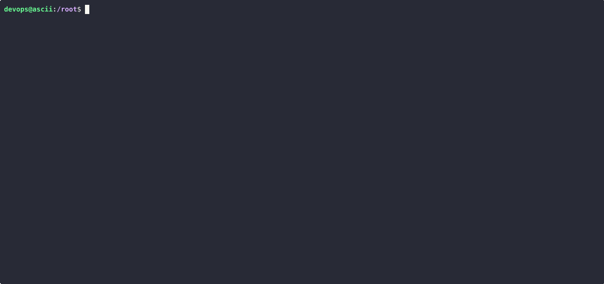

# Порівняльний аналіз інструментів для локального розгортання Kubernetes-кластерів

## Вступ

Команда **AsciiArtify** розглядає три інструменти для локального розгортання Kubernetes-кластерів: **minikube**, **kind**, та **k3d**. Ці рішення необхідні для створення Proof of Concept (PoC), тестування та автоматизації CI/CD у рамках стартапу.

## Характеристики інструментів

| Характеристика       | minikube                    | kind                         | k3d                             |
|----------------------|-----------------------------|------------------------------|----------------------------------|
| ОС-підтримка         | Linux, macOS, Windows       | Linux, macOS, Windows        | Linux, macOS, Windows           |
| Архи. підтримка      | amd64, arm64                | amd64, arm64                 | amd64, arm64                    |
| Працює у Docker?     | Частково                    | Так                          | Так                              |
| Альтернатива Podman  | Так (але з обмеженнями)     | Так (неофіційно)             | Так (експериментально)           |
| Автоматизація        | Висока                      | Висока                       | Висока                           |
| Моніторинг/GUI       | Dashboard                   | Немає                        | Немає                            |
| Важить               | >2 ГБ (VM)                  | <1 ГБ                        | <1 ГБ                            |
| Запуск кластеру      | Повільніше (~30-60 cек)     | Швидко (~10-15 cек)         | Дуже швидко (~5-10 cек)         |

## Переваги та недоліки

### Minikube
✅ **Переваги**:
- Повноцінна емуляція production середовища
- GUI Kubernetes Dashboard
- Підтримка Ingress, LoadBalancer, GPU

❌ **Недоліки**:
- Потребує віртуалізації (VM) → важко на CI
- Повільний старт
- Важкий для автоматизації з Podman

### kind
✅ **Переваги**:
- Надзвичайно легкий, швидкий запуск
- Інтегрується з CI/CD
- Працює повністю в Docker

❌ **Недоліки**:
- Обмежена підтримка LoadBalancer
- Немає GUI
- Менше налаштувань кластеру

### k3d
✅ **Переваги**:
- Легкий, підтримує multi-node
- Побудований на базі легкого дистрибутиву k3s
- Дуже швидкий запуск

❌ **Недоліки**:
- Складніша діагностика
- Менше матеріалів в спільноті ніж minikube/kind

## Демонстрація: Розгортання Hello World

Для демонстрації використано **k3d** як рекомендований інструмент.


```bash
brew install k3d          # або curl -s https://raw.githubusercontent.com/k3d-io/k3d/main/install.sh | bash
k3d cluster create asciiartify
kubectl create deployment hello-world --image=k8s.gcr.io/echoserver:1.4
kubectl expose deployment hello-world --type=NodePort --port=8080
kubectl get svc
```



## Висновки та рекомендації

| Інструмент | Рекомендовано для | Не підходить для |
|----|----|---|
| **minikube** | Ознайомлення, локальна розробка з UI | CI, швидкі тести |
| **kind** | CI/CD, автоматизація, тестування Helm | Повноцінні PoC |
| **k3d** | PoC, локальне та швидке розгортання багатовузлового кластеру | Розгортання з GUI або Dashboard |

**Рекомендація для AsciiArtify**:
Використовувати **k3d** для побудови PoC, завдяки його швидкості, підтримці багатовузлових кластерів та гнучкості. Він також сумісний із Podman, що зменшує залежність від ліцензії Docker.
