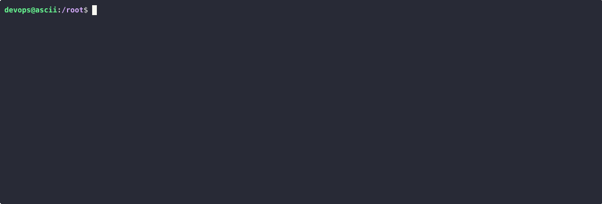
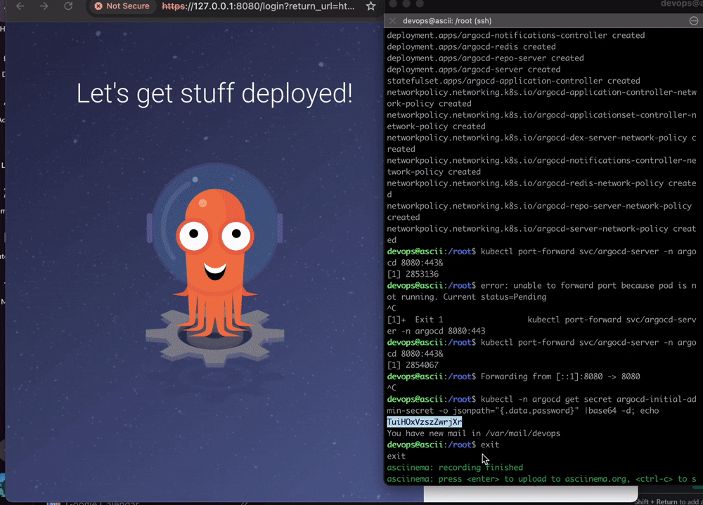

## Встановлюємо k3d — легкий спосіб запуску Kubernetes в Docker
```bash
brew install k3d
```
## АБО альтернативний спосіб встановлення через скрипт:
## curl -s https://raw.githubusercontent.com/k3d-io/k3d/main/install.sh | bash

## Створюємо кластер Kubernetes з назвою "asciiartify"
```bash
k3d cluster create asciiartify
```
## Створюємо простір імен (namespace) для Argo CD
```bash
kubectl create namespace argocd
```
## Встановлюємо Argo CD у щойно створений namespace через офіційний манифест
```bash
kubectl apply -n argocd -f https://raw.githubusercontent.com/argoproj/argo-cd/stable/manifests/install.yaml
```
## Проксіюємо порт 8080 на локальній машині до порту 443 сервісу Argo CD
```bash
kubectl port-forward svc/argocd-server -n argocd 8080:443 &
```
## Виводимо початковий пароль адміністратора Argo CD (у base64, декодуємо його)
```bash
kubectl -n argocd get secret argocd-initial-admin-secret -o jsonpath="{.data.password}" | base64 -d; echo
```




### add new application
### sourse - https://github.com/tenariaz/go-demo-app
### namespace demo
### checkbox crate namespace



